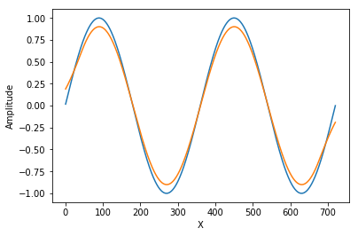

.. _chapter-examples:

========
Examples
========

Here, we look at example use cases for the library, and show how to achieve them in python and C++. Many of these are
copied straight from the unit test cases, so you can always check there to see how everything hooks up.

..  Commented out until the examples start using plotting

.. warning::
    To plot the figures in the examples, we use (in python)
    `octue's sdk, which includes plotly <https://github.com/octue/octue-sdk-python>`_, or the fledgling C++ plotting
    library (also by this author) `cpplot <https://github.com/thclark/cpplot>`_, either of which you'll need to install
    yourself - or use your preferred plotting library (e.g. matplotlib).

.. _example-obtaining-a-velocity-profile:
Obtaining a velocity profile
============================

Given a set of vertical coordinates ``z_i`` and a set of input parameters for an analytical model, how can we determine
the corresponding mean velocity profile?

.. tabs::

   .. code-tab:: c++

        #include <Eigen/Dense>
        #include <Eigen/Core>
        #include <unsupported/Eigen/AutoDiff>

        #include "relations/velocity.h"

        using namespace es;

        int main(const int argc, const char **argv) {

            // Basic boundary layer parameters
            double pi_coles = 0.42;
            double kappa = 0.41;
            double u_inf = 20.0;
            double shear_ratio = 23.6;
            double delta = 1000.0;

            // Get velocity at height z, where z is a simple double scalar
            double z_scalar = 1.0;
            double speed1 = lewkowicz_speed(z_scalar, pi_coles, kappa, u_inf, shear_ratio, delta);
            std::cout << "checked scalar double operation (U = " << speed1 << " m/s)" << std::endl;

            // Get velocity at a range of heights z
            double low = 1;
            double high = 100;
            int n_bins = 10;
            VectorXd z = VectorXd::LinSpaced(n_bins, low, high);
            VectorXd speed = lewkowicz_speed(z, pi_coles, kappa, u_inf, shear_ratio, delta);
            std::cout << "checked VectorXd operation: "<< speed.transpose() << std::endl;

            return 0;
        }

   .. code-tab:: py

        import numpy as np
        import es

        def main():

            // Basic test parameters
            pi_coles = 0.42
            kappa = 0.41
            u_inf = 20.0
            shear_ratio = 23.6
            delta = 1000.0

            // Check that it works for a z value scalar
            z = 10.0
            speed = es.relations.lewkowicz_speed(z, pi_coles, kappa, u_inf, shear_ratio, delta)
            print('checked scalar operation (U = ', speed, 'm/s)')

            // Check that it works for a numpy array input (vertically spaced z)
            low = 1
            high = 100
            n_bins = 10
            z = np.linspace(low, high, n_bins)
            speed = es.relations.lewkowicz_speed(z, pi_coles, kappa, u_inf, shear_ratio, delta)
            print('checked array operation:', speed)

            return

.. _example-fitting-a-velocity-profile:
Fitting a velocity profile
==========================

Imagine we have a vertical profile of velocity ``u(z)``, determined by an instrument such as a vertical LiDAR in VAD mode.

Say there are 30 data points, spaced 10m apart vertically. In reality, each data point is an ensemble of many thousands
of doppler velocity readings, from a region of vertical space above and below the ``z`` coordinate, known as 'bins'.

We wish to determine the parameter set for an analytical profile that best characterises the atmosphere at that point in
time. Importantly:

- We may need to fix some of the parameters, to help constrain the solver or because we know them already.
- The better our first guess, the quicker the algorithm will converge, and the more likely it is to find a sensible answer.

Under the hood, ``es-flow`` uses a Levenberg-Marquadt solution to find the best fit
(`Google's amazing ceres-solver library <>`_ is used for this). The gnarly details are wrapped for ease of use, and you
can provide an initial guess and fix certain parameters.

.. info::
    The default operation for ``fit_lewkowicz_speed`` makes some pretty heavy assumptions to make life easy for you,
    the main one being that **boundary layer thickness, ``delta``, is assumed to be ``1000m`` always.** That's pretty
    representative for Northern Europe, but does vary even here. Look at
    :ref:`example-fitting-a-turbulent-spectrum-to-lidar-data` to se how to fix and free different parameters.

.. tabs::

   .. code-tab:: c++

        #include <Eigen/Dense>
        #include <Eigen/Core>
        #include "fit.h"
        #include "relations/velocity.h"
        #include "definitions.h"

        using namespace es;

        int main(const int argc, const char **argv) {

            // 'True' profile parameters
            double pi_coles = 0.42;
            double kappa = KAPPA_VON_KARMAN;
            double u_inf = 20;
            double shear_ratio = 23.6;
            double delta_c = 1000;

            // Simulate measured data by taking the true profile and adding noise
            Eigen::ArrayXd z = Eigen::ArrayXd::LinSpaced(40, 1, 400);
            Eigen::ArrayXd u_original(40);
            Eigen::ArrayXd u_noisy(40);
            Eigen::ArrayXd u_fitted(40);
            u_original = lewkowicz_speed(z, pi_coles, kappa, u_inf, shear_ratio, delta_c);
            u_measured = u_original + ArrayXd::Random(40) / 4;
            std::cout << z.transpose() << std::endl <<std::endl;
            std::cout << u_measured.transpose() << std::endl <<std::endl;

            // Fit to find the value of parameters.
            // NB you can constrain different parameters, and use values other than the default,
            // see the docs for fit_lewkowicz_speed.
            Eigen::Array<double, 5, 1> fitted = fit_lewkowicz_speed(z, u_measured);
            u_fitted = lewkowicz_speed(z, fitted(0), fitted(1), fitted(2), fitted(3), fitted(4));

            // Sum of squares error, for exact and fitted. They should be similar, with fitted being lower.
            double lsq_error_noisy = pow(u_original-u_measured, 2.0).sum();
            double lsq_error_fitted = pow(u_fitted-u_measured, 2.0).sum();
            std::cout << "Sqd error (correct - noisy): " << lsq_error_noisy << std::endl;
            std::cout << "Sqd error (fitted - noisy) (should be lower): " << lsq_error_fitted << std::endl;

            return 0;
        }

   .. code-tab:: py

        import numpy as np
        import es

        def main():

            # WARNING - THIS IS WHAT I WANT, NOT WHAT I HAVE
            # (I'm using this section to sketch a future object oriented python API out!)

            // Simulate measured data by taking a true profile and adding noise
            pi_coles = 0.42
            kappa = 0.41
            delta = 1000.0
            u_inf = 20.0
            shear_ratio = 23.6
            z = np.linspace(1, 400, 40)
            true_speed = es.relations.lewkowicz_speed(z, pi_coles, kappa, u_inf, shear_ratio, delta)
            measured_speed = true_speed + 3 * (np.random(40) - 0.5)

            // Make an initial guess and help the solver by constraining boundary layer thickness and setting the von karman constant
            initial_guess = np.array([0.5, 0.41, np.amax(measured_speed), 20, 1000)
            fix_params = numpy.array([0, 1, 0, 0, 1], dtype=bool)

            // Run the fitting process
            prof = es.LewkowiczProfile()
            prof.fit(z, measured_speed, initial_guess, fit_params)
            print(prof.params)

            return

.. _example-smearing-and-de-smearing:
Smearing and de-smearing
========================

Say we have an instrument like a vertical profiling LiDAR, which takes measurements from a volume, rather than a point.
If we capture a profile (e.g. of velocity computed by the VAD technique), each point is the average velocity in a
vertical 'bin'. However, if the shear (``du/dz``) changes through that bin, then the average velocity is biased...
strictly speaking, the instrument applies a filter that changes the recorded velocity profile.

In order to:

#. compare like-for like when validating against another instrument like a met-mast,
#. correctly determine parameters for an analytic fit to the measurements and
#. post-process measured velocity data to `de-filter` it,

we need to be able to `smear` an analytically generated profile in the same way that measuring it with an instrument
would.

.. _example-applying-smear-to-a-velocity-profile:
Applying smear to a velocity profile
------------------------------------

For a general timeseries signal, or an image, etc, this is done by convolution - the following python script (you can copy/paste into a jupyter notebook to see it live) shows the basics, in this case a sin(x) signal being smeared out, as if measured by an instrument whose viewport is 90 degrees wide:

.. code-block:: python

    import numpy as np
    import matplotlib.pyplot as plt
    %matplotlib inline
    x = np.linspace(1, 720, 720)
    sig = np.sin((x*2*3.14159/360))

    # The kernel is a 'box filter'. It's like taking an average over a 'bin' of width 90 degrees on the x axis.
    ker = np.ones(90)
    ker = ker/sum(ker)

    convolved = np.convolve(sig, ker, 'same')

    fig, ax = plt.subplots(1, 1)
    ax.plot(x,sig)
    ax.plot(x,convolved)
    ax.set_xlabel('X')
    ax.set_ylabel('Amplitude')

    Smearing a sin signal with convolution.

Do you see the problem at the ends? For our use cases, we can't ignore errors near the endpoints. Sigh.

This is solved for you by ``es-flow``, which integrates analytical profiles over a specified vertical range, or 'bin'.
At present, we implement a top hat filter, which is pretty representative of the way in which LiDAR and SODAR units bin
their measurements. Please feed back if it'd be helpful to have other (or custom) kernel shapes!

.. tabs::

   .. code-tab:: c++

        #include <Eigen/Dense>
        #include <Eigen/Core>
        #include <unsupported/Eigen/AutoDiff>

        #include "relations/velocity.h"
        #include "utilities/smear.h"

        using namespace es;

        int main(const int argc, const char **argv) {

            // Basic boundary layer parameters
            double pi_coles = 0.42;
            double kappa = 0.41;
            double u_inf = 20.0;
            double shear_ratio = 23.6;
            double delta = 1000.0;

            // Bin size (m in the z direction)
            double bin_size = 10;

            // Get 'correct' and 'smeared' to compare
            Eigen::ArrayXd z = Eigen::ArrayXd::LinSpaced(40, 1, 400);
            Eigen::ArrayXd speed = lewkowicz_speed(z, pi_coles, kappa, u_inf, shear_ratio, delta);
            Eigen::ArrayXd speed_smeared = lewkowicz_speed_smeared(z, bin_size, pi_coles, kappa, u_inf, shear_ratio, delta);

            std::cout << "Actual wind speed: " << speed.transpose() << std::endl;
            std::cout << "Wind speed measured with a binning instrument (es-flow): " << speed_smeared.transpose() << std::endl;

            return 0;
        }

   .. code-tab:: py

        import numpy as np
        import es

        def main():

            # Basic boundary layer parameters
            pi_coles = 0.42
            kappa = 0.41
            u_inf = 20.0
            shear_ratio = 23.6
            delta = 1000.0

            # Bin size (m in the z direction)
            bin_size = 10

            # Get 'correct' and 'smeared' to compare
            z = np.linspace(1, 400, 40)
            speed = es.relations.lewkowicz_speed(z, pi_coles, kappa, u_inf, shear_ratio, delta)
            speed_smeared = es.relations.lewkowicz_speed_smeared(z, pi_coles, kappa, u_inf, shear_ratio, delta)

            print('Actual wind speed:', speed)
            print('Wind speed measured with a binning instrument (es-flow):', speed_smeared)

            return

.. _example-de-smearing-a-measured-profile:
De-smearing a measured profile
------------------------------

OK, so lets say we have measured profile data. We know our instrument has smeared the actual profile somewhat, and we
want to correct for this.

Argh, but we can't! **De-smearing is equivalent to a deconvolution.** Not only is this not guaranteed to be numerically
stable, but the problem isn't well conditioned for the case where the data points are spaced further apart from the
bins... We'd need to interpolate the measured signal to a higher spatial resolution, deconvolve then interpolate back
down. That's subject to significant error, since noise/spikes/artifacts in some vertical locations pollute their neighbours.

Never fear! Once you're fitted an analytical profile to the noisy data, ``es-flow`` makes it simple to determine a
correction for the measured data.

.. tabs::

   .. code-tab:: c++

        #include <Eigen/Dense>
        #include <Eigen/Core>
        #include <unsupported/Eigen/AutoDiff>

        #include "relations/velocity.h"
        #include "utilities/smear.h"

        using namespace es;

        int main(const int argc, const char **argv) {

            /* First, fit an analytic profile to your data... see "Fitting a velocity profile" to get the following:
             * u_original
             * u_noisy
             * fitted_params
             * u_fitted
             */

            // Use the difference between the analytical distribution and its smeared equivalent to correct the data
            Eigen::ArrayXd u_fitted_smeared = lewkowicz_speed_smeared(z, bin_size, fitted(0), fitted(1), fitted(2), fitted(3), fitted(4));
            Eigen::ArrayXd corrector = u_fitted - u_fitted_smeared;
            Eigen::ArrayXd u_measured_corrected = u_noisy + corrector;

            std::cout << "Measured wind speed: " << u_measured.transpose() << std::endl;
            std::cout << "Postprocessed (de-smeared) measurements: " << u_measured_corrected.transpose() << std::endl;

            return 0;
        }

   .. code-tab:: py

        import numpy as np
        import es

        def main():

            # First, fit an analytic profile to your data... see "Fitting a velocity profile" to get the following:
            # u_original
            # u_noisy
            # fitted_params
            # u_fitted

            # Use the difference between the analytical distribution and its smeared equivalent to correct the data
            u_fitted_smeared = lewkowicz_speed_smeared(z, bin_size, fitted[0], fitted[1], fitted[2], fitted[3], fitted[4])
            corrector = u_fitted - u_fitted_smeared
            u_measured_corrected = u_noisy + corrector

            print('Measured wind speed:', u_measured);
            print('Postprocessed (de-smeared) measurements:', u_measured_corrected)

            return

.. _example-getting-profile-derivatives:
Getting profile derivatives
===========================

.. info::
    I'm considering wrapping this code in a function to get the derivatives wrt z. Please feed back if it would be helpful for you to have a simpler way of doing this!

OK, so you fitted a profile to experimental data and have the parameter set that best represents the atmosphere at that time.
But you're a smart cookie who's calculating other complex relations, and you also need the derivative with respect to height.

Central differencing? No... there's a much more robust and accurate way. We simply use automatic differentiation:

.. tabs::

   .. code-tab:: c++

        #include <Eigen/Dense>
        #include <Eigen/Core>
        #include <unsupported/Eigen/AutoDiff>

        #include "relations/velocity.h"

        using namespace es;
        using namespace Eigen;

        int main(const int argc, const char **argv) {

            typedef Eigen::AutoDiffScalar<Eigen::VectorXd> ADScalar;
            ADScalar ads_z;
            ADScalar ads_speed;
            VectorXd dspeed_dz;
            dspeed_dz.setZero(n_bins);

            for (int k = 0; k < n_bins; k++) {
                ads_z.value() = z[k];
                ads_z.derivatives() = Eigen::VectorXd::Unit(1, 0);
                ads_speed = power_law_speed(ads_z, u_ref, z_ref, alpha);
                dspeed_dz[k] = ads_speed.derivatives()[0];
            }

            std::cout << "speed = ["     << speed.transpose()     << "];" << std::endl;
            std::cout << "dspeed_dz = [" << dspeed_dz.transpose() << "];" << std::endl;

            return 0;
        }

   .. code-tab:: py

        # WARNING - I'm afraid no API for this has been created in python yet. TODO!
        def main():
            return

.. _example-obtaining-a-spectral-profile:
Obtaining a spectral profile
============================

The Atmospheric Boundary Layer has a turbulent spectrum which varies with height. At each height in a spectral profile,
the amplitude of the spectrum varies with wavenumber ( frequency). There are also six terms in a turbulent spectrum
``S_i_j`` (not 9, since the tensor is symmetric, i.e. ``S_1_2 = S_2_1``).

.. warning::

    You'd expect a spectral profile to be a tensor with dimension ``nz x nf x 6``. But, we don't do that... instead we
    actually return 6 ``nz x nf`` arrays.

    Yes, we know this is a hassle. Why? Two reasons:
    - It's actually bloody annoying doing tensors with Eigen, because their tensor library is undocumented and very feature-light in terms of indexing (it's an unsupported extension, which I firmly believe whould be part of core), so C++ users can expect some unnecessarily heavy syntax if you try. What a drag. Let's see what happens in the next few releases.

    - Pybind doesn't bind ``Eigen::Tensor``s. Sure, I could fork it and add tensors (`this issue, open at the time of writing, gives some hints <https://github.com/pybind/pybind11/issues/1377>`_) but would rather be working on core features here. If a contributor wants to do the work of sorting pybind to work with ``Eigen::Tensor``s then I'll happily update at this end.

.. tabs::

   .. code-tab:: c++

        #include <Eigen/Dense>
        #include <Eigen/Core>
        #include <unsupported/Eigen/AutoDiff>

        #include "relations/velocity.h"

        using namespace es;

        int main(const int argc, const char **argv) {

            // Boundary layer parameters (full ADEM set)
            double pi_coles = 0.42;
            double kappa = 0.41;
            double u_inf = 20.0;
            double shear_ratio = 23.6;
            double delta = 1000.0;
            double beta = 0.0;
            double zeta = 0.0;
            Eigen::ArrayXd parameters = Eigen::ArrayXd(7);
            parameters << pi_coles, kappa, u_inf, shear_ratio, delta, beta, zeta;

            // Set z at which you want the spectra
            Eigen::ArrayXd z = Eigen::VectorXd::LinSpaced(40, 1, 400);

            // Set the frequency range in Hz you want
            Eigen::ArrayXd f = Eigen::VectorXd::LinSpaced(100, 0.01, 20);

            // Allocate output arrays to contain the spectral tensor
            Eigen::ArrayXXd spectrum_1_1 = Eigen::ArrayXXd(z.cols(), f.cols());
            Eigen::ArrayXXd spectrum_1_2 = Eigen::ArrayXXd(z.cols(), f.cols());
            Eigen::ArrayXXd spectrum_1_3 = Eigen::ArrayXXd(z.cols(), f.cols());
            Eigen::ArrayXXd spectrum_2_2 = Eigen::ArrayXXd(z.cols(), f.cols());
            Eigen::ArrayXXd spectrum_2_3 = Eigen::ArrayXXd(z.cols(), f.cols());
            Eigen::ArrayXXd spectrum_3_3 = Eigen::ArrayXXd(z.cols(), f.cols());

            // Calculate the spectra
            adem_spectra(
                z,
                f,
                parameters,
                spectrum_1_1,
                spectrum_1_2,
                spectrum_1_3,
                spectrum_2_2,
                spectrum_2_3,
                spectrum_3_3
                );

            // Printing to the command line sucks. Let's do something beautiful...

            return 0;
        }

   .. code-tab:: py

        import numpy as np
        import es

        def main():

            // Basic test parameters
            pi_coles = 0.42
            kappa = 0.41
            u_inf = 20.0
            shear_ratio = 23.6
            delta = 1000.0

            // Check that it works for a z value scalar
            z = 10.0
            speed = es.relations.lewkowicz_speed(z, pi_coles, kappa, u_inf, shear_ratio, delta)
            print('checked scalar operation (U = ', speed, 'm/s)')

            // Check that it works for a numpy array input (vertically spaced z)
            low = 1
            high = 100
            n_bins = 10
            z = np.linspace(low, high, n_bins)
            speed = es.relations.lewkowicz_speed(z, pi_coles, kappa, u_inf, shear_ratio, delta)
            print('checked array operation:', speed)

            return

.. _example-fitting-a-turbulent-spectrum-to-lidar-data:
Fitting a turbulent spectrum to LiDAR data
==========================================

Using the Spectral relations provided by the Attached-Detached Eddy Method :ref:`relation_adem`, we can fit the spectrum
generated in the ADEM process to a *partial* spectrum obtainable from LiDAR. The spectrum obtainable from LiDAR is of
course band limited, so we fit to the valid part of the LiDAR spectrum.

.. info::
    As a task for the advanced data scientist, try playing around with which parameters are fixed and which aren't.
    The example below prioritises a good fit to the boundary layer profile (using the default options of
    ``fit_lewkowicz_speed()`` as a guess and as fixed parameters) then uses the remaining two parameters to fit the
    spectral shape and amplitude.

    Change around which parameters are fixed and unfixed, in both the velocity and the spectral fix. You can get a
    better representation of the spectrum, if spectral shape and amplitude is your highest priority.

.. tabs::

    .. code-tab:: c++

        #include <Eigen/Dense>
        #include <Eigen/Core>

        #include "relations/velocity.h"
        #include "relations/spectra.h"

        using namespace es;

        int main(const int argc, const char **argv) {

            // Create simulated 'measured' dataset (see 'Obtaining a spectral profile', above)
            // whose bandwidth goes up to 3Hz, with a noise up to 20% of magnitude applied to the 'true' spectra
            double pi_coles = 1.19;
            double kappa = 0.41;
            double u_inf = 20.0;
            double shear_ratio = 28.1;
            double delta = 1000.0;
            double beta = 1.45;
            double zeta = 2.18;
            Eigen::ArrayXd parameters = Eigen::ArrayXd(7);
            parameters << pi_coles, kappa, u_inf, shear_ratio, delta, beta, zeta;
            Eigen::ArrayXd z = Eigen::VectorXd::LinSpaced(40, 1, 500);
            true_u = lewkowicz_speed(z, pi_coles, kappa, u_inf, shear_ratio, delta_c);
            measured_u = true_u + ArrayXd::Random(40) / 4;
            Eigen::ArrayXd f_measured = Eigen::VectorXd::LinSpaced(100, 0.01, 3);
            Eigen::ArrayXd true_u(40);
            Eigen::ArrayXd measured_u(40);
            Eigen::ArrayXXd true_spectrum_1_1 = Eigen::ArrayXXd(z.cols(), f.cols());
            Eigen::ArrayXXd true_spectrum_1_2 = Eigen::ArrayXXd(z.cols(), f.cols());
            Eigen::ArrayXXd true_spectrum_1_3 = Eigen::ArrayXXd(z.cols(), f.cols());
            Eigen::ArrayXXd true_spectrum_2_2 = Eigen::ArrayXXd(z.cols(), f.cols());
            Eigen::ArrayXXd true_spectrum_2_3 = Eigen::ArrayXXd(z.cols(), f.cols());
            Eigen::ArrayXXd true_spectrum_3_3 = Eigen::ArrayXXd(z.cols(), f.cols());
            adem_spectra(
                z,
                f,
                parameters,
                true_spectrum_1_1,
                true_spectrum_1_2,
                true_spectrum_1_3,
                true_spectrum_2_2,
                true_spectrum_2_3,
                true_spectrum_3_3
            );
            Eigen::ArrayXXd measured_spectrum_1_1 = true_spectrum_1_1 * (Eigen::ArrayXXd::Random(z.cols(), f.cols()) * 0.4 + 1);
            Eigen::ArrayXXd measured_spectrum_1_2 = true_spectrum_1_2 * (Eigen::ArrayXXd::Random(z.cols(), f.cols()) * 0.4 + 1);
            Eigen::ArrayXXd measured_spectrum_1_3 = true_spectrum_1_3 * (Eigen::ArrayXXd::Random(z.cols(), f.cols()) * 0.4 + 1);
            Eigen::ArrayXXd measured_spectrum_2_2 = true_spectrum_2_2 * (Eigen::ArrayXXd::Random(z.cols(), f.cols()) * 0.4 + 1);
            Eigen::ArrayXXd measured_spectrum_2_3 = true_spectrum_2_3 * (Eigen::ArrayXXd::Random(z.cols(), f.cols()) * 0.4 + 1);
            Eigen::ArrayXXd measured_spectrum_3_3 = true_spectrum_3_3 * (Eigen::ArrayXXd::Random(z.cols(), f.cols()) * 0.4 + 1);

            // We can use the velocity to fit most of the parameters in the model, so do that first (most robust)
            // Here, we set the default fixed parameters (von karman constant and boundary layer thickness).
            Eigen::Array<double, 5, 1> fitted_params_u;
            Eigen::Array<bool, 5, 1> fixed_params_u;
            fitted_params_u << 0.5, KAPPA_VON_KARMAN, measured_u.maxCoeff();, 20, 1000;
            fixed_params_u << false, true, false, false, true;
            fit_lewkowicz_speed(z, measured_u, fixed_params_u, fitted_params_u, true);

            // We use those, plus beta=0, zeta=0 (fully equilibrium boundary layer) as an initial guess to the spectrum
            // fit - keeping the ones we've already defined fixed.
            Eigen::Array<double, 7, 1> fitted_params_s;
            Eigen::Array<bool, 7, 1> fixed_params_s;
            fitted_params_s <<
                fitted_params_u(0),
                fitted_params_u(1),
                fitted_params_u(2),
                fitted_params_u(3),
                fitted_params_u(4),
                0.0,
                0.0;
            fixed_params_s << true, true, true, true, true, false, false;
            fit_adem_spectra(
                z,
                measured_spectrum_1_1,
                measured_spectrum_1_2,
                measured_spectrum_1_3,
                measured_spectrum_2_2,
                measured_spectrum_2_3,
                measured_spectrum_3_3,
                fixed_params_u,
                fitted_params_u,
                true
            );
            std::cout << "Fitted spectral parameters:" << std::endl;
            std::cout << fitted_params.transpose() << std::endl;

        }

    .. code-tab:: py

        # WARNING - I'm afraid no API for this has been created in python yet. TODO!
        def main():
            return

